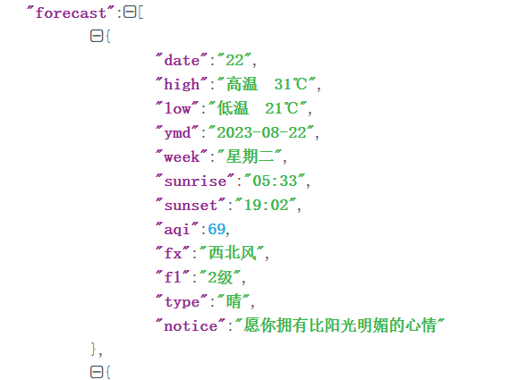

# 天气预报

## 1.整体效果、技术点

在左上角输入要查询的城市，然后点击查询按钮，就会发生**http**请求给服务器，请求回来的天气数据为**JSON**格式通过解析**JSON**可以获取以下信息：

- 今天的信息

  温度，湿度，风向，风力，天气类型（晴，多云，小雨等），PM2.5，温馨提示，感冒指数，日出日落

- 未来15天的信息

  日期，星期，天气类型（晴，多云，小雨等），PM2.5，最高温，最低温


### 1.1 样式表的设置

合理地使用样式表，可以使界面更加美观，这里设置的样式表如下：

- 背景图片

为整个窗体设置一张背景图片

- 背景色

设置控件背景透明，或者设置一个透明度

- 圆角

为控件设置圆角

- 字体颜色和大小

为控件设置合适的字体颜色和字体大小


### 1.2 JSON数据格式

**HTTP**服务端返回的天气数据，是**JSON**格式

使用Qt提供的，解析**JSON**相关的类，可以很方便地解析出其中的字段


### 1.3 HTTP请求

根据**HTTP**服务端提供的接口，发送**http**请求，获取天气数据

### 1.4 事件

为了界面的美观，我们将窗口设置为无标题栏，这样就无法通过右上角的【关闭】按钮，退出程序

因此增加了右键菜单退出的功能

还重写了鼠标移动事件，让窗口可以跟随鼠标移动


### 1.5 绘图

绘制高低温曲线，根据每天高低温数据，可以绘制一个曲线，更直观地展示温度变化趋势


### 1.6 资源文件

根据不同的天气类型，还可以用不同的图标进行展示，更加直观

而这些图标通常会放到资源文件中，这样它们可以一同被打包进qt的可执行程序中

## 2.JSON数据格式


### 2.1 什么是JSON？

在讲解 **JSON**之前，首先想这么一种场景：

通常，客户端和服务端要进行通信，那么通信采用什么数据格式呢?

比如**C++**写的服务端，创建一个**Person**对象：

```c++
Class Person{
	string name;
	string gender;
	int age;
};
```

怎么将服务端创建的**Person**对象，传递到客户端呢？

直接传**Person**对象肯定是不合适的，因为客户端可能甚至不是**C++**写的，可能是**java**写的，**java**不认识**C++**中的对象，更有甚者，客户端是一个单片机的设备，是用**C**语言写的，**C**语言是面向过程的，压根就没有类和对象的概念

此时就需要一种通用的数据格式，就是**JSON**


**JSON**（JavaScript Object Notation）,中文名***JS对象表示法***，因为它和JS中的对象的写法很类似

通常说的**JSON**，其实就是**JSON**字符串，本质上是一种特俗格式的字符串

**JSON**是一种轻量级的数据交换格式，客户端和服务端数据交互，基本都是**JSON**格式的


**特点**：

1. 便于阅读和书写

   除了**JSON**格式，还有一种数据传输格式**XML**，相对于**XML**，**JSON**更加便于阅读和书写

2. 独立于编程语言

​		**JSON**完全独立于编程语言，并不是说名字里有**JavaScript**，就只能在**JavaScript**中使用，不是这样的

​		**JSON**和**JavaScript**的关系，就类似于雷锋和雷锋塔，并没有什么关系

​		几乎在所有的编程语言和开发环境中，都有解析和生成**JSON**字符串的库，比如：

```c++
#C
Jansson,cJSON

#C++
jsonCpp,JSON or Modern C++

#Java
json-lib,org-json

#Android
Gson,FastJson

#Qt
QJsonxxx
```

3. 网络传输的标准数据格式

基于以上特点,JSON成为网络传输使用率最高的数据格式


### 2.2JSON的两种数据格式

**JSON** 有两种数据格式

- **JSON** 对象
- **JSON** 数组

规则：被大括号包裹的是**JSON** 对象；被中括号包裹的**JSON**数组


#### 2.2.1 JSON数组

JSON数组格式：

```json
[元素1,元素2,元素3,...元素n]
```

类似于C/C++中的数组，元素之间是以逗号分隔

不同的是，**JSON**数组的元素可以是不同的数据类型，包括：整形，浮点型，字符串，布尔类型，**JSON**数组，**JSON**对象，空值


**JSON**数组中的元素是同一类型

```json
//元素中的类型都是数字
[1,2,3,4]

//元素类型都是字符串
["SPring","Summer","Autumn","Winter"]
```


**JSON** 数组中的元素是不同类型

```json
[1,2.5,"hello",true,false,null]
```


**JSON**数组的嵌套

```json
[
	[1,2,3,4],
	["SPring","Summer","Autumn","Winter"],
	[1,2.5,"hello",true,false,null]
]
```


**JSON**数组嵌套 **JSON**对象

```json
[
	{
		"name":"TOM",
		"age":18,
		"gender":"male"
	},
	{
		"name":"TOM",
		"age":18,
		"gender":"male"
	}
]
```


#### 2.2.2 JSON对象

**JSON**对象格式：

```json
{
	"key1":value1,
	"key2":value2,
	"key3":value3,
}
```

**JSON** 对象内部使用**键值对**的方式来组织

键和值之间使用**冒号**分隔，多个键值之间使用**逗号**分隔

键是字符串类型，值的类型可以是：整形，浮点型，字符串，布尔类型，**JSON**数组，**JSON**对象，空值

eg:

```json
{
	"name":"TOM",
	"age":18,
	"gender":"male"
}
```


**JSON** 对象中，还可以嵌套**JSON**对象和**JSON**数组

```json
{
	"name":"China",
	"info":{
		"capitcal":"beijing",
		"asian":"true",
		"founded":1949
	},
    "provinces":[{
        "name":"guangdong",
        "capital":"shenzheng"
    },{
        "name":"fujian",
        "capital":"xiamen"
    }]
}
```


### 2.3JSON 在线解析

**JSON**本质是一种特殊格式的字符串

实际工作中，这个**JSON**字符串可能是自己手写的，也可能来自网络接收的数据


而我们获取到的**JSON**字符串，可能是自己写的，也可能是服务端返回的，

是压缩的格式，没有换行和缩进，不方便判断格式是否正确


这时候就要用**JSON**在线解析工具，来校验**JSON**的格式


### 2.4 Qt中使用JSON

从**QT5.0**开始提供了对 **JSON**的支持，使用Qt提供的 **JSON**类，可以很方便地生成 **JSON**字符串，以及解析 **JSON**字符串

#### 2.4.1 JSON相关的类

Qt提供的与 **JSON**相关的类，有四个

- **QJsonObject**
- **QJsonArray**
- **QJsonValue**
- **QJsonDocument**


##### 2.4.1.1 **QJsonObject**

**QJsonObject**封装了**JSON**中的对象，可以存储多个键值对

其中，键为字符串类型，值为**QJsonValue**类型

- 创建一个 **QJsonObject**对象

```c++
QJsonObject::QJsonObject();
```

- 将键值对添加到 **QJsonObject**对象中

```c++
QJsonObject::iterator insert(const QString &key,const QJsonValue &vlaue)
```

- 获取 **QJsonObject**对象中键值对的个数

```c++
int QJsonObject::count() const;
int QJsonObject::size() const;
int QJsonObject::length() const;
```

- 通过**key**得到**value**

```c++
QJsonValue QJsonObject::value(const QString &key) const;
QJsonValue QJsonObject::operator[](const QString &key)const;
```

- 检查 **key**是否存在

```c++
iterator QJsonObject::find(const QString &kev);
bool QJsonObject::contains(const QString &kev);
```


##### 2.4.1.2 **QJsonArray**

**QJsonArray** 封装了**JSON**中的数组，数组中元素的类型统一为 **QJsonValue**类型


- 创建一个 **QJsonArray**

```c++
QJsonArray::QJsonArray();
```

- 添加数组元素

```c++
//添加头部和尾部
void QJsonArray::append(const QJsonArray &value);
void QJsonArray::prepend(const QJsonArray &value);

//插入到 i 的位置之前
void QJsonArray::insert(int i , const QJsonArray &value);

//添加到头部和尾部
void QJsonArray::push_back(const QJsonArray &value);
void QJsonArray::push_front(const QJsonArray &value);
```

- 获取 **QJsonArray**中元素个数

```c++
int QJsonArray::count() const;
int QJsonArray::size() const;
```

- 获取元素的值

```c++
//获取头部和尾部
QJsonValue QJsonArray::first()const;
QJsonValue QJsonArray::last()const;

//获取指定位置
QJsonValue QJsonArray::at(int i)const;
QJsonValueRef QJsonArray::operator[](int i);
```

- 删除元素

```c++
//删除头部和尾部
void QJsonArray::pop_back();
void QJsonArray::pop_frony();

void QJsonArray::removeFirst();
void QJsonArray::removeLast();

//删除指定位置
void QJsonArray::removeAt(int i);
QJsonValue QJsonArray::takeAt(int i);
```


##### 2.4.1.3 QJsonValue

它封装了 **JSON**支持的六种数据类型：

```c++
//布尔类型
QJsonValue::Bool
    
//浮点类型（包括整形）
QJsonValue::Double
    
//字符串类型
QJsonValue::String
    
//Json数组类型
QJsonValue::Array
    
//Json对象类型
QJsonValue::Object
    
//空值类型
QJsonValue::Null
```

可以通过以下方式构造 **QJsonValue**对象

```c++
//字符串
QJsonValue(const char *s);
QJsonValue(QLatinlString s);
QJsonValue(const QString &s);

//整形 和 浮点型
QJsonValue(qint64 v);
QJsonValue(int v);
QJsonValue(double v);

//布尔类型
QJsonValue(bool b);

//JSON对象
QJsonValue(const QJsonObject &o);

//JSON数组
QJsonValue(const QJsonArray &a);

//空值类型
QJsonValue(QJsonValue::Type type =Null);
```


如果已经得到了一个 **QJsonValue**对象，如何判断其内部封装的是什么类型的数据：

使用以下判断函数

```c++
//是否是字符串
bool isString()const;

//是否是整形 和 浮点型
bool isDouble()const;

//是否是布尔类型
bool isBool()const;

//是否是JSON对象
bool isObject()const;

//是否是JSON数组
bool isArray()const;

//是否是未定义类型（无法识别的类型）
bool isUndefined()const;

//是否是空值类型
bool isNull()const;
```


通过以上判断函数，获取到其内部数据的实际类型之后，如果有需求就可以再次将其转换为对应的基础数据类型，对应的 **API**函数如下：

```c++
/转换为字符串类型
QString toString()const;
QString toString(const QString &defaultValue)const;

//转换为整形 
int toInt(int defaultValue = 0)const;

//转换为浮点型
double toDouble(double defaultValue = 0)const;

//转换为布尔类型
bool toBool(bool defaultValue =false)const;

//转换为JSON对象
QJsonObject toObject(const QJsonObject &defaultValue)const;
QJsonObject toObject()const;

//转换为JSON数组
QJsonArray toArray(const QJsonArray &defaultValue)const;
QJsonArray toArray()const;
```


##### 2.4.1.4 QJsonDocument

它封装了一个完整的 **JSON**文档

它可以从 **UTF-8**编码的基于文本的表示，以及**Qt**本身的二进制格式读取和写入该文档

**QJsonObject**和 **QJsonArray**这两个对象是不能直接转换为字符串类型的，需要通过 **QJsonDocument**类来完成二者的转换


- **QJsonObject**  / **QJsonArray** -->字符串

```c++
//1.创建QJsonDocument对象
//以 QJsonObject或者QJsonArray 为参数来创建QJsonDocument对象
QJsonDocument::QJsonDocument(const QJsonObject &object);
QJsonDocument::QJsonDocument(const QJsonArray &array);

//2.将 QJsonDocument对象中的数据进行序列化
//通过调用toXXX()方法就可以得到文本格式或者二进制的Json 字符串了
QByteArray QJsonDocument::toBinaryData()  const;		//二进制格式的json字符串
QByteArray QJsonDocument::toJson(JsonFormat format = Indented)const;		//文本格式

//3.使用得到的字符串进行数据传输，或者保存到文件
```

- 字符串 -->**QJsonObject**  / **QJsonArray** 

通常，通过网络接收或者读取磁盘文件，会得到一个 JSON格式的字符串，之后可以按照如下步骤，解析出 JSON字符串中的一个个字段

```c++
//1.将 JSON字符串转换为QJsonDocument对象
[static]QJsonDocument QJsonDocument::fromBinaryData(const QByteArray &data, DataValidation validation = Validate);
[static]QJsonDocument QJsonDocument::fromJson(const QByteArray &json, QJsonParseError *error= Q_NULLPTR);

//2.将文档对象转换为json 数组/对象
//2.1判断文档对象中存储的数据，是JSON数组还是JSON对象
bool QJsonDocument::isArray()const;
bool QJsonDocument::isObject()const;

//2.2之后，就可以转换为JSON 数组或 JSON对象
QJsonObject QJsonDocument::object()const;
QJsonArray QJsonDocument::array()const;

//3.调用QJsonArray /QJsonObject 类提供的 API获取存储在其中的数据
```


#### 2.4.2构建JSON字符串

在网络传输时，通常是传输的 **JSON**字符串

传输之前，首先要生成 **JSON**字符串，

```json
{
	"name":"China",
	"info":{
		"capitcal":"beijing",
		"asian":"true",
		"founded":1949
	},
    "provinces":[{
        "name":"guangdong",
        "capital":"guangzhou"
    },{
        "name":"fujian",
        "capital":"fuzhou"
    }]
}
```


在 **Qt**中实现代码（控制程序即可，不用界面）

```c++
#include <QCoreApplication>
#include<QJsonObject>
#include<QJsonArray>
#include<QJsonDocument>

#include<QFile>
#include<QDebug>

void writeJson()
{
    QJsonObject rootObj;

    //1.插入name字段
    rootObj.insert("name","China");

    //2.插入info字段
    QJsonObject infoObj;
    infoObj.insert("capitcal","beijing");
    infoObj.insert("asian","true");
    infoObj.insert("founded",1949);
    rootObj.insert("info",infoObj);

    //3.插入prvince字段
    QJsonArray provinceArray;

    QJsonObject provinceShandongObj;
    provinceShandongObj.insert("name","guangdong");
    provinceShandongObj.insert("capital","guangzhou");

    QJsonObject provinceFujianObj;
    provinceFujianObj.insert("name","fujian");
    provinceFujianObj.insert("capital","fuzhou");

    provinceArray.append(provinceShandongObj);
    provinceArray.append(provinceFujianObj);

    rootObj.insert("provinces",provinceArray);

    //4.将rootObj转换为json字符串
    QJsonDocument doc(rootObj);     //把 JSON字段 作为参数放入QJsonDocument中
    QByteArray json =doc.toJson();

    //5.1 打印输出
    qDebug()<<QString(json).toUtf8().data();

    //5.2将json字符串写入到文件
    QFile file("E:\\VS_project\\qt\\qt_B\\JSON_demo\\china.json");
    file.open(QFile::WriteOnly);
    file.write(json);
    file.close();
}

int main(int argc, char *argv[])
{
    QCoreApplication a(argc, argv);
    writeJson();

    return a.exec();
}
```


#### 2.4.3 解析JSON字符串

通常接收网络数据的格式是 **JSON**格式

在接受完毕之后，需要解析出其中的每一个字段，根据各个字段的值做相应的显示或者其他处理

接下来使用**Qt**提供的工具类，读取文件中的 **JSON**字符串，把其中的字段解析处理

```c++
void fromJson()
{
    //1.读取文件
    QFile file("E:\\VS_project\\qt\\qt_B\\JSON_demo\\china.json");
    file.open(QFile::ReadOnly);
    QByteArray json =file.readAll();    //获取china.jason中的数据到QByteArray类json中
    file.close();

    //2.解析json
    QJsonDocument doc =QJsonDocument::fromJson(json);   //将获取到的json 作为参数放入QJsonDocument类的doc中
    if(!doc.isObject()){                                //判断doc是不是一个json对象
        qDebug()<<"Not an object";
        return;
    }

    QJsonObject obj=doc.object();       //将doc的json对象，存入obj
    QStringList keys=obj.keys();        //获取obj中的key
    for(int i=0;i<keys.size();i++)      //遍历key
    {
        //获取key-value
        QString key=keys[i];
        QJsonValue value=obj.value(key);

        //对json对象中的元素进行判断
        if(value.isBool()){
            //如果是bool类型
            qDebug()<<key<<":"<<value.toBool();
        }
        else if(value.isString()){
            qDebug()<<key<<":"<<value.toString();
        }
        else if(value.isDouble()){
            qDebug()<<key<<":"<<value.toInt();
        }
        else if(value.isObject()){
            qDebug()<<key<<":";

            QJsonObject infoObj =value.toObject();      //这里应该也要进行判断，和上面一样，节省时间直接写了
            QString capital =infoObj["capital"].toString();
            bool asian =infoObj["asian"].toBool();
            int founded =infoObj["founded"].toInt();

            qDebug()<< "  "<<"capital"<<":"<<capital;
            qDebug()<< "  "<<"asian"<<":"<<asian;
            qDebug()<< "  "<<"founded"<<":"<<founded;
        }
        else if(value.isArray()){
            qDebug()<<key<<":";
            QJsonArray provinceArray = value.toArray();

            for(int i=0;i<provinceArray.size();i++){
                QJsonObject provinceObj=provinceArray[i].toObject();

                QString name=provinceObj["name"].toString();
                QString capital=provinceObj["capital"].toString();

                qDebug()<<"  "<<"name"<<":"<<name;
                qDebug()<<"  "<<"capital"<<":"<<capital;
            }
        }
    }
}

int main(int argc, char *argv[])
{
    QCoreApplication a(argc, argv);
    //writeJson();

    fromJson();
    return a.exec();
}
```


## 3. HTTP通信

### 3.1 HTTP概述

**HTTP** ：超文本传输协议（**H**yper**T**ext**T**ransfer**P**rotocol）

**HTTP** 是浏览器端 **web**通信的基础

#### 3.1.1 两种架构

##### 3.1.1.1 B/S 架构

B/S 架构：**Browser/Server** ,浏览器/服务器 架构

B：浏览器，比如IE  Google

S:  服务器，比如Apache , nginx等


##### 3.1.1.2 C/S 架构

C/S 架构： **Client/Server**  客户端/服务器架构


B/S 架构相对于 C/S 架构，客户机上无需安装任何软件，使用浏览器即可访问服务器

因此，越来越多的C/S架构正被B/S架构所替代


#### 3.1.2 基于请求响应的模式


**HTTP** 协议永远都是客户端发起请求，服务端做出响应

也就是说，请求必定是从客户端发起的，服务器端在没有接收到请求之前不会发送任何响应

这就**无法**实现这样一种场景：服务端主动推送消息给客户端


#### 3.1.3 无状态

当浏览器第一次发送请求给服务器时，服务器做出了响应；

当浏览器第二次发送请求给服务器时，服务器同样可以做出响应，但服务器并不知道第二次的请求和第一次来自同一个浏览器

也就是是说，服务器是不会记住你是谁的，所以是无状态的


而如果要使 **HTTP**协议有状态，就可以使浏览器访问服务器时，加入cookie

这样，只要你在请求时有了这个**cookie**，服务器就能通过**cookie**知道，你就是之前那个浏览器

这样的话，**HTTP**协议就有状态了


#### 3.14 请求报文

请求报文由四部分组成：

```json
请求行 + 请求头(请求首部字段) + 空行 + 实体
```

- 请求行

​		请求行里面有：

​		请求方法 ：比如 **GET**  、**POST**

​		资源对象 ：**URL**

​		协议名称和版本号 ： HTTP/1.1

```json
POST /custom/a287498349493783/web/cstm?stm=10351516512615 HTTP/1.1

POST														//即请求方法
/custom/a287498349493783/web/cstm?stm=10351516512615		//即URL
HTTP/1.1													//即协议和版本
```

- 请求头

​		请求头由于告诉服务器该请求的一些消息，起到传递额外信息的，目的

```json
Host: api.growingio.com
User-Agent: Mozilla/5.0 (Macintosh; Intel Mac OS X 10.15; rv:91.0) Gecko/20100101 Firefox/91.0
Accept: */*
Accept-Language: zh-CN,zh;q=0.8,zh-TW;q=0.7,zh-HK;q=0.5,en-US;q=0.3,en;q=0.2
Accept-Encoding: gzip, deflate, br
Content-Length:264
Origin:https://leetcode-cn.com
Sec-Fetch-Dest:empty
Sec-Fetch-Mode:no-cors
Sec-Fetch-Site:cross-site
Referer:https://leetcode-cn.com/
```

- 空行

​		空行是为了区分 请求头 和 请求实体

- 请求实体

​		请求实体即真正所需要传输的数据


#### 3.15  响应报文

响应报文同样是由四部分组成：

```json
状态行 + 响应头 + 空行 + 消息体
```

- 状态行

​		状态行主要由三部分组成：

​		**HTTP** 版本

​		状态码 （表示相应的结果）

​		原因短语（解释）

```json
HTTP/2 200 OK

HTTP/2		//协议和版本
200			//状态码 200代表OK，表示请求成功；404代表NOT FOUND 表示请求失败，所请求资源未在服务器上发现
OK			//原因短语
```

- 响应头（响应报文首部）

​		和请求报文首部一样，响应报文首部同样是为了传递额外信息，例如：

```json
date: Tue, 05 Apr 2022 10:48:17 GMT 			//响应时间
content-type:application/json					//响应格式
content-length:127								//长度
strict-transport-security: max-age=31536000
X-Firefox-Spdy:h2
```

- 空行

​		同样是为了区别响应实体和响应首部

- 响应实体

​		真正存储响应信息的部分


#### 3.16 请求方式

**HTTP** 常用的请求方法有很多，但最常用的是 **GET** 和 **POST**

二者最主要的区别是：

- **GET** 请求的参数位于 **URL**中，会显示在地址栏上
- **POST** 请求的参数位于 **request body** 请求体中

因此，**GET** 请求的安全性不如 POST 请求，并且 GET 请求的参数有长度限制，而 **POST** 没有 


### 3.2 Postman


http://t.weather.itboy.net/api/weather/city/101010100


1. 点击"+"即可打开一个用于发送请求的标签页
2. 选择请求的方法（GET / POST），并输入请求的URL
3. 点击 【Params】，可以添加参数
4. 点击 【Headers】, 可以添加请求头
5. 点击 【Send】，发送该请求到服务器
6. Body ,响应体，也就是服务器返回的实际数据，响应体中选择右侧的【JSON】格式，并选择【Pretty】,可以对 JSON数据做美化显示
7. Headers ，响应头，也就是服务器返回的响应体数据


### 3.3 Qt实现HTTP请求

Qt框架提供了专门的类，方便实现HTTP请求

#### 3.3.1 创建“网络访问管理”对象

首先需要创建一个 **QNetworkAccessManger** 对象，这是 Qt中进行 HTTP请求的开端

```c++
mNetAccessManager = new QNetworkAccessManger(this);
```


#### 3.3.2 关联信号槽

在发送HTTP请求之前，先关联信号槽

```c++
//获取到数据之后
connect(mNetAccessManager,&QNetworkAccessManger::finished,this,&MainWindow::onReplied);
```

当请求结束，获取到服务器的数据时，mNetAccessManager会发射一个 **finished** 信号，该信号携带一个 **QNetworkReply** 的参数

服务器返回的所有数据就封装在其中，通过 QNetworkReply 类提供的各种方法，就可以获取响应头，响应体等各种数据


#### 3.3.3 发送请求

发送 HTTP请求

```c++
QUrl	url("http://t.weather.itboy.net/api/weather/city/101010100");
mNetAccessManager->get(QNetworkRequest(url));
```

根据请求的地址构建出一个 **QUrl**对象，然后直接调用 **QNetworkAccessManager** 的 get方法，即可发送一个 GET请求


#### 3.3.4 接收数据

由于上面绑定了信号槽，服务器返回数据后，自动调用我们自定义的槽函数 **onReplied**

onReplied函数的标准写法：

```c++
void MainWindow::onReplied(QNetworkReply* reply)
{
	//响应的状态码为200，表示请求成功
	int status_code = reply->attribute(QNetworkRequest::HttpStatusCodeAttribute).toInt();
	
	qDebug() << "operation:" << reply->operation();			//请求方式
	qDebug() << "status code:" << status_code;				//状态码
	qDebug() << "url:" <<reply->url();						//url
	qDebug() << "raw header:" <<relpy->rawHeaderList();		//header
	
	if(reply->error() != QNetworkReply::NoError || status_code != 200){
		QMessageBox::warning(this,"提示","请求数据失败！",QMessageBox::Ok);
	}
	else{
		//获取响应信息
		QByteArray reply_data = reply->readAll();
		QByteArray byteArray = QString(reply_data).toUtf8();
		qDebug() << "read all:" << byteArray.data();
		
		//parseJson();			//解析JSON	
	}
	reply->deleteLater();
}
```

可见，**QNetworkReply**中封装了服务器返回的所有数据，包括响应体，响应的状态码，响应体等


## 4.详细实现步骤

### 4.1新建工程，右键退出

#### 4.1.1 创建工程

新建工程命名为Weather

基类为QMainWindow

添加资源文件，images.qrc，把res资源添加到工程目录下

#### 4.1.2 设置窗口大小，无边框

在ui文件中，设置固定大小800*450

```c++
//mainwindow.cpp
//构造函数下:
    setWindowFlag(Qt::FramelessWindowHint);             //设置窗口无边框
    setFixedSize(width(),height());                     //设置固定窗口大小
```


#### 4.1.3 实现右键退出

重写父类的菜单事件，默认上下文菜单事件虚函数，是不会进行任何操作的

```c++
//mainwindow.h
#include<QContextMenuEvent>

protected:
    void contextMenuEvent(QContextMenuEvent *event);

private:
    QMenu *mExitMenu;       //右键退出的菜单
    QAction *mExitAct;      //退出的行为-菜单项
```

```c++
//mainwindow.cpp
#include <QCursor>

//构造函数下：
    //构建右键菜单
    mExitMenu =new QMenu(this);
    mExitAct =new QAction();

    mExitAct->setText("退出");                           //设置菜单项名称为退出
    mExitAct->setIcon(QIcon(":/res/close.png"));        //设置菜单项图标

    mExitMenu->addAction(mExitAct);                     //把菜单项添加到菜单中

    connect(mExitAct,&QAction::triggered,this,[=](){	//连接槽函数，实现点击即退出
        qApp->exit(0);
    });
    
void MainWindow::contextMenuEvent(QContextMenuEvent *event)     //重写父类的contextMenuEvent虚函数，其父类中默认是忽略右键菜单事件
{
    //弹出右键菜单
    mExitMenu->exec(QCursor::pos());        //跟踪鼠标，在鼠标右键的地方弹出这个菜单项
    
    event->accept();                        //调用accept，表示这个事件已经处理，不需要向上传递
}

```


### 4.2界面布局

整体布局：

在 centralWidget 下再添加一个 widget，之后所有控件都是放在这个 widget窗口下


#### 4.2.1 设置窗口背景

设置 widget样式表：

```c++
QWidget#widget{
	border-image: url(:/res/background.png);
}

QLabel {
	font: 25 10pt "微软雅黑";
	border-radius: 4px;
	background-color: rgba(60, 60, 60, 100);
	color: rgb(255, 255, 255);
}
```

- 整个窗口的背景就设置为资源文件中的 background.png
- widget 窗口中的所有标签的字体、边框圆角、背景色、前景色
- 如果要单独设置某个标签的样式，直接将要设置的样式，设置到对应标签上即可


#### 4.2.2 标签显示图片

设置标签显示图片：

- ​	属性窗口
- 代码动态设置图片

一开始默认写死，先看到基本框架，后面导入数据再进行动态设置


#### 4.2.3 修改控件名称

见名知义原则


| lblGanMao                   |  | 即**感冒指数显示**(默认QLabel)             |
| --------------------------- | ------------------------------------------------------------ | ------------------------------------------ |
| lblWindIcon                 |  | 今天风向的图标 (固定)                      |
| lblWindFl、lblWindFx        |  | 今天**风 的风力等级**、**风 的风向**       |
| lblShiDuIcon                |  | 湿度图标 (固定)                            |
| lblShiDu、lblShiDuTitle     |  | 湿度文本 (固定)、**湿度数值显示**          |
| lblPm25Icon                 |  | PM2.5 图标  (固定)                         |
| lblPm25、lblPm25Title       |  | PM2.5文本(固定)、**PM2.5数值显示**         |
| lblQualityIcon              |  | 今天空气质量图标  (固定)                   |
| lblQuality、lblQualityTitle |  | 今天空气质量文本(固定)、**空气质量值显示** |
| lblDate0                    |  | **日期显示**，标号从0到5可以显示6天        |
| lblWeek0                    |  | **星期显示**，今天明天星期几，标号从0到5   |
| lblType0                    |  | **天气的文本**，晴雨等，标号0到5           |
| lblTypeIcon0                |  | **天气的图标**，和标号一一对应             |
| lblHighCurve                |                                                              | 折线图，**最高温**                         |
| lblLowCurve                 |                                                              |                                            |
| lblFl0                      |  | **风力等级** 标号0到5                      |
| lblFx0                      |  | **风向风向 **标号0到5                      |
| lblQuality0                 |  | **空气质量** 标号0到5                      |
| lblTypeIcon                 |  | 今天的**天气图标**                         |
| lblLowHigh                  | 同上                                                         | 今天温度的**最低到最高温度**，19°~31°      |
| lblType                     |                                                              | 今天天气的文本，晴转多云                   |
| lblTemp                     |                                                              | **当前温度**，32°                          |
| lblCity                     |                                                              | **当前城市**                               |
| btnSearch                   |  | **搜索**按钮，QPushButton                  |
| lblDate                     |  | **当前日期**                               |
| leCity                      |  | **选择城市**,QLineEdit                     |


### 4.3 窗口移动，系统托盘

#### 4.3.1 重写父类的鼠标移动事件


```c++
//mainwindow.h
#include<QMouseEvent>

protected:
    void mousePressEvent(QMouseEvent *event);
    void mouseMoveEvent(QMouseEvent *event);
    
private:
    QPoint mOffset;         //窗口移动时，鼠标与窗口左上角的偏移
```

```c++
//mainwindow.cpp
//重写父类的鼠标事件
void MainWindow::mousePressEvent(QMouseEvent *event)
{
    mOffset =event->globalPos() - this->pos();          //偏移量=鼠标点击处距离桌面左上角的距离-窗口左上角距离桌面左上角的距离
}

void MainWindow::mouseMoveEvent(QMouseEvent *event)
{
    this->move(event->globalPos() - mOffset);           //设置窗口移动到 (当前鼠标点击处距离桌面左上角的距离 - 偏移量)的位置
```


#### 4.3.2设置系统托盘

声明系统托盘动作及初始化操作

```c++
//mainwindow.h
#include<QSystemTrayIcon>
private:
	//系统托盘
    QSystemTrayIcon *mysystemTray;
    void systemtrayiconActivated(QSystemTrayIcon::ActivationReason reason);     //响应系统托盘的动作（双击操作）
    void initsystemtrayIcon();          //系统托盘的初始化操作
```

相应实现

```c++
//mainwindow.cpp

//系统托盘
void MainWindow::systemtrayiconActivated(QSystemTrayIcon::ActivationReason reason)      //响应系统托盘的动作（双击操作）
{
    switch(reason){
    case QSystemTrayIcon::DoubleClick:      //双击
        //显示  隐藏  界面
        if(isHidden())
        {
            show();
        }
        else
        {
            hide();
        }
        break;
    default:
        break;
    }
}

void MainWindow::initsystemtrayIcon()       //系统托盘初始化操作
{
    mysystemTray =new QSystemTrayIcon(this);
    mysystemTray->setIcon(QIcon(":/res/WeaFor.png"));       //设置图标
    connect(mysystemTray,&QSystemTrayIcon::activated,this,&MainWindow::systemtrayiconActivated);

    //添加应该退出应用程序菜单
    QAction  *actionsystemquit =new QAction(QIcon(":/res/close.png"),u8"退出程序");     //创建一个功能--退出程序以及它的图标
    connect(actionsystemquit,&QAction::triggered,this,[=](){
        qApp->exit(0);
    });

    QMenu *pcontextmenu=new QMenu(this);        //创建菜单项
    pcontextmenu->addAction(actionsystemquit);      //给这个菜单项增加退出程序的功能
    mysystemTray->setContextMenu(pcontextmenu);     //把这个菜单项加入系统托盘
    mysystemTray->show();

}
```

在构造函数中 调用初始化函数

```c++
//mainwindow.cpp
//构造函数下：
{
	initsystemtrayIcon();       //系统托盘的初始化操作
}
```


### 4.4 HTTP请求天气数据

#### 4.4.1 添加网络模块

```c++
QT       += core gui network
```


#### 4.4.2 声明网络对象，槽函数

在头文件中，声明用于 **http**通信的 **QNetworkAccessManager** 指针对象

用于处理**http**服务返回数据的**onReplied** 槽函数

```c++
//mainwindow.h
#include<QNetworkAccessManager>
#include<QNetworkReply>

private slots:
    void onReplied(QNetworkReply *reply);		//onReplied槽函数,当获取到网络请求的数据，就调用
private:
    QNetworkAccessManager *mNetAccessManager;	//指针对象
```

#### 4.4.3 关联信号槽

将 **QNetworkAccessManager** 的 finished信号，与自定义的 **onReplied**槽函数进行关联

```c++
//mainwindow.cpp

//构造函数下
{
    //http通信
    mNetAccessManager =new QNetworkAccessManager(this);
    connect(mNetAccessManager,&QNetworkAccessManager::finished,this,&MainWindow::onReplied);
}
```

#### 4.4.4 发送http请求

声明用于发送http请求的成员函数

```c++
//mainwindow.h
protected:
    void getWeatherInfo(QString cityCode);
```

然后，调用**getWeatherInfo** 来发送http请求

```c++
//mainwindow.cpp

#include<QUrl>
//构造函数下：
{
   //直接在构造中，请求天气数据，（前期测试）
    getWeatherInfo("101010100");        //北京城市编码
}

void MainWindow::getWeatherInfo(QString cityCode)       //获取天气数据
{
    QUrl url("http://t.weather.itboy.net/api/weather/city/"+cityCode);
    mNetAccessManager->get(QNetworkRequest(url));		//请求数据  ，请求成功就会调用onReplied
}
```


#### 4.4.5 接收服务端数据

当http请求完毕，服务器返回数据时，**mNetAccessManager** 就会发射一个finished 信号，进而调用onReplied槽函数

服务器返回的所有数据，都封装在**QNetworkReply**中，包括响应头，状态码，响应体等

```c++
//mainwindow.cpp

#include<QDebug>
#include<QMessageBox>

void MainWindow::onReplied(QNetworkReply *reply)         //数据处理
{
    qDebug()<<"onReplied success";

    //响应状态码为200，表示请求成功
    int status_code=reply->attribute(QNetworkRequest::HttpStatusCodeAttribute).toInt();
    qDebug()<<"operation: "<<reply->operation();			//请求方式
    qDebug()<<"status code: "<<status_code;					//状态码  
    qDebug()<<"url: "<<reply->url();						//url
    qDebug()<<"raw header"<<reply->rawHeaderList();			//header
    
	//如果指定的城市编码不存在，就会报错
	//"Error transfering  http://t.weather.itboy.net/api/weather/city/000000000 -server replied: Not Found"
    if(reply->error()!= QNetworkReply::NoError || status_code !=200){
        qDebug("%s(%d) error:%s",__FUNCTION__,__LINE__,reply->errorString().toLatin1().data());
        QMessageBox::warning(this,"天气","请求数据失败！",QMessageBox::Ok);
    }
    else{
        //获取响应信息
        QByteArray byteArray=reply->readAll();
        qDebug()<<"readAll:"<<byteArray.data();
        //parseJson(byteArray);
    }
    
    reply->deleteLater();

}

```


### 4.5 解析天气数据

#### 4.5.1 定义两个类

在界面上主要显示的是今天天气和最近六天的天气，所以创建一个weatherdata.h，并定义两个类

##### 4.5.1.1 Today

用于显示今天的所有天气参数，也就是屏幕左侧的数据

##### 4.5.1.2 Day

用于显示六天的天气参数，就是屏幕右侧的数据


进而方便将解析出的数据保存到类的成员变量中

```c++
//weatherdata.h
#include<QString>

class Today{
public:
    Today()
    {
        date = "2022-10-20";
        city = "广州";
        
        ganmao = "感冒指数";
        
        wendu = 0;
        shidu= "0%";
        pm25 = 0;
        quality = "无数据";
        
        type= "多云";
        
        fl = "2级";
        fx = "南风";
        
        high = 30;
        low =18;
    }
    
    QString date;
    QString city;
    
    QString ganmao;
    
    int wendu;
    QString shidu;
    int pm25;
    QString quality;
    
    QString type;
    
    QString fx;
    QString fl;
    
    int high;
    int low;
};

class Day{
public:
    Day()
    {
        date = "2022-10-20";
        week = "周五";
        
        type = "多云";
        
        high = 0;
        low = 0;
        
        fx = "南风";
        fl = "2级";
        
        api =0 ;
    }
    QString date;
    QString week;
    
    QString type;
    
    int high;
    int low;
    
    QString fx;
    QString fl;
    
    int api; 
};
```


#### 4.5.2 解析数据

声明解析的成员函数**parseJson** ， 并且声明两个类 用于存放数据

```c++
//mainwindow.h

#include"weatherdata.h"
protected: 
    void parseJson(QByteArray& byteArray);  //解析

private:
    //将获取的数据放入这两个类中，方便后续展示
    Today mToday;
    Day mDay[6];
```

获取得到的json数据，在解析工具中 可以看到，整体的数据：


yesterday的数据：


forecast的数据（未来五天）：截取其中一天



今天的数据data:


具体实现**parseJson**

```c++
//mainwindow.cpp

#include<QJsonDocument>
#include<QJsonObject>
#include<QJsonArray>

void MainWindow::parseJson(QByteArray &byteArray)       //数据解析
{
    QJsonParseError err;
    QJsonDocument doc =QJsonDocument::fromJson(byteArray,&err);     //如果出错会把出错信息存到err中
    if(err.error != QJsonParseError::NoError)           //如果err不等于NoError 就出错退出
    {
        return;
    }

    //开始解析
    QJsonObject rootObj  =doc.object();
    qDebug()<<rootObj.value("message").toString();

    //1.解析日期和城市
    mToday.date=rootObj.value("date").toString();                                   //解析出date
    mToday.city=rootObj.value("cityInfo").toObject().value("city").toString();      //先获取到json对象cityInfo 在在其中获取到city

    //2.解析yesterday
    QJsonObject objData=rootObj.value("data").toObject();
    QJsonObject objYesterday = objData.value("yesterday").toObject();       //先获取到json对象data,在去获取json对象yesterday

    mDay[0].week =objYesterday.value("week").toString();        //mDay是0-5的数组，其中对应yesterday的是第0元素
    mDay[0].date =objYesterday.value("ymd").toString();

    mDay[0].type =objYesterday.value("type").toString();

        //最高温最低温        高温低温读取到的数据是 "高温 18℃" 存在中文字符空格，这里只要获取其中的数字其中℃占一个字符
    QString s;
    s=objYesterday.value("high").toString().split(" ").at(1);       //获得高温字段的字符串，之后用split进行分割，分割依据是空格，取后面的数据，即01中的1，就可以取得18℃
    s=s.left(s.length()-1);       //将s缩短长度，即利用left方法，把s的长度-1就可以获得前面的18了
    //s=s.left(2);                //left方法：从左到右获取count个字符
    mDay[0].high=s.toInt();     //把s转为int型赋给high

    s=objYesterday.value("low").toString().split(" ").at(1);       //18℃
    s=s.left(s.length()-1);       //18
    //s=s.left(2);
    mDay[0].low=s.toInt();

        //风向风力
    mDay[0].fx=objYesterday.value("fx").toString();
    mDay[0].fl=objYesterday.value("fl").toString();

        //污染指数 aqi
    mDay[0].aqi=objYesterday.value("aqi").toDouble();

    //3.解析forcast中五天的数据
    QJsonArray forecastArr=objData.value("forecast").toArray();     //forecast 是一个json数组

    for(int i=0;i<5;i++)        //获取五天的数据，从今天开始的五天，不包括昨天
    {
        QJsonObject objForecast=forecastArr[i].toObject();      //获取forecast中的josn对象，进行赋值

        //不获取昨天的数据 所以应该是从1开始，所以参数应该是i+1开始
        mDay[i+1].week=objForecast.value("week").toString();
        mDay[i+1].date=objForecast.value("ymd").toString();

        //天气类型
        mDay[i+1].type=objForecast.value("type").toString();

        //高温低温
        QString s;
        s=objForecast.value("high").toString().split(" ").at(1);    //18℃
        s=s.left(s.length()-1);       //18
        //s=s.left(2);
        mDay[i+1].high=s.toInt();

        s=objForecast.value("low").toString().split(" ").at(1);    //18℃
        s=s.left(s.length()-1);       //18
        //s=s.left(2);
        mDay[i+1].low=s.toInt();

        //风向风力
        mDay[i+1].fx=objForecast.value("fx").toString();
        mDay[i+1].fl=objForecast.value("fl").toString();

        //污染指数 aqi
        mDay[i+1].aqi=objForecast.value("aqi").toDouble();

    }

    //4.解析今天的数据 用mToday去存储
    mToday.ganmao=objData.value("ganmao").toString();

    mToday.wendu=objData.value("wendu").toString().toInt();
    mToday.shidu=objData.value("shidu").toString();
    mToday.pm25=objData.value("pm25").toDouble();  //pm2.5原先就是int类型，转为dobule类型即可，不可以过String
    mToday.quality=objData.value("quality").toString();

    //5.forcast中第一个数组元素，也是今天的数据
    //今天的数据也属于五天之中的数据，所以要把今天的数据mToday也给到mDay
    mToday.type = mDay[1].type;

    mToday.fx = mDay[1].fx;
    mToday.fl = mDay[1].fl;

    mToday.high = mDay[1].high;
    mToday.low = mDay[1].low;


    //6.更新UI
    updateUI();
}
```

在**onReplied**中调用**parseJson**

```c++
//mainwindow.cpp
void MainWindow::onReplied(QNetworkReply *reply)        //数据处理
{
	...
    else{
        //获取响应信息
        QByteArray byteArray=reply->readAll();
        qDebug()<<"readAll:"<<byteArray.data();
        
        parseJson(byteArray);							///调用parseJson解析数据			
    }
	....
}
```


### 4.6 更新UI界面

#### 4.6.1 创建控件数组

六天的UI控件，显示语句基本相同，所以可以使用循环来写，这时候就需要将这些控件放入相应的控件数组进行控制

```c++
//mainwindow.h
#include<QLabel>

private:
    //创建一些控件数组
    //星期和日期
    QList<QLabel*> mWeekList;
    QList<QLabel*> mDateList;
    //天气和天气图标
    QList<QLabel*> mTypeList;
    QList<QLabel*> mTypeIconList;
    //天气污染指数
    QList<QLabel*> mAqiList;
    //风力风向
    QList<QLabel*> mFxList;
    QList<QLabel*> mFlList;
```

 在mainwindow.cpp中初始化列表

```c++
//mainwindow.cpp

//构造函数下:
{
    //4.UI初始化
    //将控件添加到控件数组，方便循环处理
    //星期和日期
    mWeekList<<ui->lblWeek0<<ui->lblWeek1<<ui->lblWeek2<<ui->lblWeek3<<ui->lblWeek4<<ui->lblWeek5;
    mDateList<<ui->lblDate0<<ui->lblDate1<<ui->lblDate2<<ui->lblDate3<<ui->lblDate4<<ui->lblDate5;
    //天气和天气图标
    mTypeList<<ui->lblType0<<ui->lblType1<<ui->lblType2<<ui->lblType3<<ui->lblType4<<ui->lblType5;
    mTypeIconList<<ui->lblTypeIcon0<<ui->lblTypeIcon1<<ui->lblTypeIcon2<<ui->lblTypeIcon3<<ui->lblTypeIcon4<<ui->lblTypeIcon5;
    //天气指数
    mAqiList<<ui->lblQuality0<<ui->lblQuality1<<ui->lblQuality2<<ui->lblQuality3<<ui->lblQuality4<<ui->lblQuality5;
    //风向和风力
    mFxList<<ui->lblFx0<<ui->lblFx1<<ui->lblFx2<<ui->lblFx3<<ui->lblFx4<<ui->lblFx5;
    mFlList<<ui->lblFl0<<ui->lblFl1<<ui->lblFl2<<ui->lblFl3<<ui->lblFl4<<ui->lblFl5;
}
```


#### 4.6.2 更新UI

```c++
//mainwindow.h
protected:
    void updateUI();                        //更新UI
```

```c++
//mainwindow.cpp
void MainWindow::updateUI()
{
    //1.更新日期，右上角
    //ui->lblDate->setText(mToday.date)         //直接获取json的数据 得到的日期是20220210的格式，做一个转换
    ui->lblDate->setText(QDateTime::fromString(mToday.date,"yyyyMMdd").toString("yyyy/MM/dd")+" "+mDay[1].week);    //显示右上角的日期+星期

    //2.更新城市,右边 城市框
    ui->lblCity->setText(mToday.city);

    //3.更新今天数据  左侧今天的数据
    ui->lblTemp->setText(QString::number(mToday.wendu));            //温度
    ui->lblType->setText(mToday.type);                              //天气文本
    ui->lblLowHigh->setText(QString::number(mToday.low)+"~"+QString::number(mToday.high)+"°C");     //最低温到最高温

    ui->lblGanMao->setText("感冒指数: "+mToday.ganmao);               //感冒指数
    ui->lblWindFx->setText(mToday.fx);                              //风向
    ui->lblWindFl->setText(mToday.fl);                              //风力

    ui->lblPM25->setText(QString::number(mToday.pm25));             //PM2.5

    ui->lblShiDu->setText(mToday.shidu);                            //湿度
    ui->lblQuality->setText(mToday.quality);                        //空气质量

    //4.更新六天数据,右侧界面
    for(int i=0;i<6;i++)
    {
        //4.1更新日期和时间
        mWeekList[i]->setText("周"+mDay[i].week.right(1));           //转换格式将星期几 转成周几
        ui->lblWeek0->setText("昨天");                                //将前三天固定写为昨天今天明天
        ui->lblWeek1->setText("今天");
        ui->lblWeek2->setText("明天");

        QStringList ymdList=mDay[i].date.split("-");                //json数据日期格式为：2023-02-18    以"-"为分割依据，将其分为3部分012
        mDateList[i]->setText(ymdList[1]+"/"+ymdList[2]);           //取ymdList的12部分，即02/18

        //4.2更新天气类型
        mTypeList[i]->setText(mDay[i].type);

        //4.3更新空气质量
        //对aqi进行判断，赋予相应等级
        if(mDay[i].aqi >= 0 && mDay[i].aqi <= 50)
        {
            mAqiList[i]->setText("优");                              //0~50  优
            mAqiList[i]->setStyleSheet("background-color: rgb(121, 184, 0);");      //设置风格样式，改变颜色
        }
        else if(mDay[i].aqi >= 50 && mDay[i].aqi <= 100)
        {
            mAqiList[i]->setText("良");                              //50~100  良
            mAqiList[i]->setStyleSheet("background-color: rgb(255, 187, 23);");      //设置风格样式，改变颜色
        }
        else if(mDay[i].aqi >= 100 && mDay[i].aqi <= 150)
        {
            mAqiList[i]->setText("轻度");                              //100~150  轻度
            mAqiList[i]->setStyleSheet("background-color: rgb(255, 87, 97);");      //设置风格样式，改变颜色
        }
        else if(mDay[i].aqi >= 150 && mDay[i].aqi <= 200)
        {
            mAqiList[i]->setText("中度");                              //150~200  中度
            mAqiList[i]->setStyleSheet("background-color: rgb(235, 17, 27);");      //设置风格样式，改变颜色
        }
        else if(mDay[i].aqi >= 200 && mDay[i].aqi <= 250)
        {
            mAqiList[i]->setText("重度");                              //200~250  重度
            mAqiList[i]->setStyleSheet("background-color: rgb(170, 0, 0);");      //设置风格样式，改变颜色
        }
        else
        {
            mAqiList[i]->setText("严重");                              //大于250  严重
            mAqiList[i]->setStyleSheet("background-color: rgb(110, 0, 0);");      //设置风格样式，改变颜色
        }
        
        //4.4 更新风力风向
        mFxList[i]->setText(mDay[i].fx);
        mFlList[i]->setText(mDay[i].fl);
    }
}
```

在 parseJson解析处理中 调用updateUI

```c++
//mainwindow.cpp
void MainWindow::parseJson(QByteArray &byteArray)       //数据解析
{
    //6.更新UI
    updateUI();
}
```


##### 4.6.2.1天气图标处理

```c++
//mainwindow.h
private:
   //天气图标
    QMap<QString,QString> mTypeMap;     //用于英文到中文的转换
```

```c++
//mainwindow.cpp
//构造函数下:
{
    //天气图标设置
    //以天气类型作为key，以资源路径作为value,初始化MAP
    mTypeMap.insert("暴雪",":/res/type/BaoXue.png");
    mTypeMap.insert("暴雨",":/res/type/BaoYu.png");
    mTypeMap.insert("暴雨到大暴雨",":/res/type/BaoYuDaoDaBaoYu.png");
    mTypeMap.insert("大暴雨",":/res/type/DaBaoYu.png");
    mTypeMap.insert("大暴雨到特大暴雨",":/res/type/DaBaoYuDaoTeDaBaoYu.png");
    mTypeMap.insert("大到暴雪",":/res/type/DaDaoBaoXue.png");
    mTypeMap.insert("大到暴雨",":/res/type/DaDaoBaoYu.png");
    mTypeMap.insert("大雪",":/res/type/DaXue.png");
    mTypeMap.insert("大雨",":/res/type/DaYu.png");
    mTypeMap.insert("冻雨",":/res/type/DongYu.png");
    mTypeMap.insert("多云",":/res/type/DuoYun.png");
    mTypeMap.insert("浮尘",":/res/type/FuChen.png");
    mTypeMap.insert("雷阵雨",":/res/type/LeiZhenYu.png");
    mTypeMap.insert("雷阵雨伴有冰雹",":/res/type/LeiZhenYuBanYouBingBao.png");
    mTypeMap.insert("霾",":/res/type/Mai.png");
    mTypeMap.insert("强沙尘暴",":/res/type/QiangShaChenBao.png");
    mTypeMap.insert("晴",":/res/type/Qing.png");
    mTypeMap.insert("沙尘暴",":/res/type/ShaChenBao.png");
    mTypeMap.insert("特大暴雨",":/res/type/TeDaBaoYu.png");
    mTypeMap.insert("undefined",":/res/type/undefined.png");
    mTypeMap.insert("雾",":/res/type/Wu.png");
    mTypeMap.insert("小到中雪",":/res/type/XiaoDaoZhongXue.png");
    mTypeMap.insert("小到中雨",":/res/type/XiaoDaoZhongYu.png");
    mTypeMap.insert("小雪",":/res/type/XiaoXue.png");
    mTypeMap.insert("小雨",":/res/type/XiaoYu.png");
    mTypeMap.insert("雪",":/res/type/Xue.png");
    mTypeMap.insert("扬沙",":/res/type/YangSha.png");
    mTypeMap.insert("阴",":/res/type/Yin.png");
    mTypeMap.insert("雨",":/res/type/Yu.png");
    mTypeMap.insert("雨夹雪",":/res/type/YuJiaXue.png");
    mTypeMap.insert("阵雪",":/res/type/ZhenXue.png");
    mTypeMap.insert("阵雨",":/res/type/ZhenYu.png");
    mTypeMap.insert("中到大雪",":/res/type/ZhongDaoDaXue.png");
    mTypeMap.insert("中到大雨",":/res/type/ZhongDaoDaYu.png");
    mTypeMap.insert("中雪",":/res/type/ZhongXue.png");
    mTypeMap.insert("中雨",":/res/type/ZhongYu.png");
}
```

返回继续处理更新UI界面的天气图标

```c++
//mainwindow.cpp
void MainWindow::updateUI()
{
	//3.更新今天数据  左侧今天的数据
	ui->lblTypeIcon->setPixmap(mTypeMap[mToday.type]);              //天气图标，以通过type做为key，进到mTypeMap去获得它的value 继而获得图片资源地址，在贴上去，进而更新图标
	
	//4更新六天数据
		//4.2更新天气类型
        mTypeIconList[i]->setPixmap(mTypeMap[mDay[i].type]);        //取到type作为key,到mTypeMap中找到value
		
}
```


### 4.7城市编码

#### 4.7.1 创建一个工具类

创建一个weathertool.h

创建一个工具类，来通过城市名进而获取到9位城市编码

```c++
//weathertool.h
#include<QMap>
#include<QFile>

#include<QJsonArray>
#include<QJsonDocument>
#include<QJsonObject>
#include<QJsonParseError>
#include<QJsonValue>

class WeatherTool{
    
private:
    static QMap<QString,QString> mCityMap;      //声明一个静态成员，QMap
    
    static void initCityMap(){                  //初始化CityMap
        //1.读取文件
        QString filePath ="E:\\Project\\QT_Weather\\Qt_Weather\\citycode.json";
        
        QFile file(filePath);
        file.open(QIODevice::ReadOnly | QIODevice::Text);
        QByteArray json=file.readAll();
        file.close();
        
        //2.解析并写入map
        QJsonParseError err;                    
        QJsonDocument doc =QJsonDocument::fromJson(json,&err);         //如果解析错误，把错误信息存到err中
        if(err.error!= QJsonParseError::NoError)
        {
            return;
        }
        if(!doc.isArray())      //如果不是数组
        {
            return;
        }
        
        //开始解析
        QJsonArray cities=doc.array();      //把doc转换成QJsonArray格式
        for(int i=0;i<cities.size();i++)
        {
            QString city=cities[i].toObject().value("city_name").toString();
            QString code=cities[i].toObject().value("city_code").toString();
            
            //把获取到的json数据转换成QString格式然后存入QMap中
            if(code.size() > 0){                    //citycode.json文件当中，省份的city_code是空，不将其存入map
                mCityMap.insert(city,code); 
            }    
        }   
    }
    
public:
    static QString getCityCode(QString cityName){       //声明静态成员函数getCityCode，通过key:city_name值去获得value:city_code
        if(mCityMap.isEmpty()){                         //如果位空就初始化citymap
            initCityMap();
        }
        QMap<QString,QString>::iterator it =mCityMap.find(cityName);        //获取iterator，进而拿到key和value
        //输入北京/北京市
        if(it==mCityMap.end()){
            it =mCityMap.find(cityName + "市");          //在遍历寻找北京市
        }
        if(it!=mCityMap.end()){
            return it.value();
        }
        return "";
    }
};

QMap<QString,QString> WeatherTool::mCityMap={};  
```


#### 4.7.2 调用这个工具类

```c++
//mainwindow.cpp
#include "weathertool.h"
//构造函数下:
{
    //3.网络通信请求（http通信）
    //直接在构造中，请求天气数据，（前期测试）
    //getWeatherInfo("101010100");        //北京
    //getWeatherInfo("101280101");        //广州
    getWeatherInfo("广州");				//可以通过输入字符串 来进行查询
}

//将原先的获取天气数据函数进行修改
//void MainWindow::getWeatherInfo(QString cityCode)       //获取天气数据
//{
//    QUrl url("http://t.weather.itboy.net/api/weather/city/"+cityCode);
//    mNetAccessManager->get(QNetworkRequest(url));       //请求数据  ，请求成功就会调用onReplied
//}

/*---------------------------------------------修改如下-------------------------------------------------*/
void MainWindow::getWeatherInfo(QString cityName)       //获取天气数据
{
    QString cityCode=WeatherTool::getCityCode(cityName);        //通过getCityCode方法利用key：cityName去获取到cityCode

    //当输入城市错误时进行判断
    if(cityCode.isEmpty()){
        QMessageBox::warning(this,"天气","请检查输入是否正确！",QMessageBox::Ok);
        return;
    }

    QUrl url("http://t.weather.itboy.net/api/weather/city/"+cityCode);
    mNetAccessManager->get(QNetworkRequest(url));       //请求数据  ，请求成功就会调用onReplied
}
```


#### 4.7.3 实现程序外设置城市

在ui界面中 搜索城市的按钮 转到槽

```c++
//mainwindow.cpp
void MainWindow::on_btnSearch_clicked()
{
    QString cityName =ui->leCity->text();
    getWeatherInfo(cityName);
}
```


### 4.8 绘制温度曲线

将6天的数据，使用曲线连接起来，使得天气趋势一目了然

具体流程：

- 调用标签的**update**方法
- 框架发送QEvent::Paint事件给标签
- 事件被MainWindow拦截，进而调用其**eventFilter**方法
- 在eventFilter中，调用**paintHighCurve**和 **paintLowCurve**来绘制曲线
- 

#### 4.8.1 安装事件过滤器

位高低温的标签 **lblHighCurve**和**lblLowCurve** 安装事件过滤器

```c++
//mainwindow.cpp
//构造函数下:
    //5.给标签添加事件过滤器
    //给高低温曲线添加事件过滤器，参数指定位this,也就是当前窗口对象MainWindow
    //指定了当前窗口，就给当前窗口重写eventFiter方法，当有标签的事件到来时候，当前窗口就会对它进行过滤，当前窗口捕获了这个事件之后，就可以在当前窗口进行绘制曲线
    ui->lblHighCurve->installEventFilter(this);     
    ui->lblLowCurve->installEventFilter(this);
```


#### 4.8.2 重写eventFilter方法

重写MainWindow下的evenFilter方法

这样就可以在eventFilter方法中拦截发向lblHighCurve和lblLowCurve 这两个控件的事件

```c++
//mainwindow.h
protected: 
    bool eventFilter(QObject *watched,QEvent *event);       //重写父类的eventFilter方法
```

```c++
//mainwindow.cpp
bool MainWindow::eventFilter(QObject *watched, QEvent *event)       //事件过滤器，捕获事件
{
    //对绘制高低温曲线的控件进行监听，捕获其事件，以绘制曲线
    if(watched==ui->lblHighCurve && event->type()==QEvent::Paint){
        paintHighCurve();
    }
    if(watched==ui->lblLowCurve && event->type()==QEvent::Paint){
        paintLowCurve();
    }
    return QWidget::eventFilter(watched,event);
}
```


#### 4.8.3 绘制曲线

具体方法：

首先，声明绘制高低温曲线的两个成员函数

```c++
//mainwindow.h
protected: 
    //绘制高低温曲线
    void paintHighCurve();
    void paintLowCurve();
```

具体绘画函数

```c++
//mainwindow.cpp
#include<QPainter>
#include<QPen>
#include<QPoint>
#include<QBrush>

#define INCREMENT 3     //温度每升高/降低1°，y轴坐标的增量
#define POINT_RADIUS 3  //曲线描点（空心圆）的大小
#define TEXT_OFFSET_X 12    //X轴偏移
#define TEXT_OFFSET_Y 12    //Y轴偏移

void MainWindow::paintHighCurve()
{
    QPainter painter(ui->lblHighCurve);     //绘画区域

    //抗锯齿
    painter.setRenderHint(QPainter::Antialiasing,true);     //抗锯齿效果，true是开关

    //1.获取x坐标
    int pointX[6] = {0};        //定义x坐标的数组
    for(int i=0;i<6;i++){
        pointX[i]=mWeekList[i]->pos().x()+mWeekList[i]->width()/2;  //x坐标=上方日期控件的中心位置=日期控件的坐标(左上角顶点)+控件宽度的一半，就是中心位置
    }

    //2.获取y坐标
    int tempSum = 0;
    int tempAverage=0;
    for(int i=0;i<6;i++){
        tempSum += mDay[i].high;        //对6天的高温进行求和
    }
    tempAverage=tempSum/6;          //最高温的平均值
    //图中显示的曲线，在lbael框中，中心位置应该为平均值，若高于平均值在其上方，低于在下方；高一度就向上移动3像素
        //计算y轴坐标
    int pointY[6]={0};              //定义y坐标的数组
    int yCenter =ui->lblHighCurve->height()/2;      //确定平均值所在的区域，为label区域高度一半的位置
    for(int i=0;i<6;i++){
        //Qt中 坐标计算，向下是+，向上是-
        pointY[i] =yCenter-((mDay[i].high-tempAverage) * INCREMENT);        //y坐标=中心值高度-（温度-平均值）*3像素      如果平均值16，当日温度17则y=h-(17-16)*3=h-3,即在中心位置向上移动3像素
    }

    //3.开始绘制
    //3.1初始化画笔相关工具
    QPen pen=painter.pen();                 //获取画笔
    pen.setWidth(1);                        //设置画笔的宽度
    pen.setColor(QColor(255,170,0));        //设置画笔的颜色

    painter.setPen(pen);                    //设置画笔
    painter.setBrush(QColor(255,170,0));    //设置画刷颜色，填充内部

    //3.2画点，文本
    for(int i=0;i<6;i++){
        //显示点
        painter.drawEllipse(QPoint(pointX[i],pointY[i]),POINT_RADIUS,POINT_RADIUS);         //绘制点（圆心坐标，xy半径（这里是xy的偏移）），但此时是空心圆，需要画刷填充

        //显示温度
        painter.drawText(pointX[i]-TEXT_OFFSET_X,pointY[i]-TEXT_OFFSET_Y,QString::number(mDay[i].high)+"°");        //绘制文本，使其位于点的上方，（绘制点坐标（要一定偏移，不然和点重合了），文本信息）
    }
    //3.3 连线    两点之间确定一条直线，一共绘制五次
    for(int i=0;i<5;i++){       //不能到6，因为素组是0-5的，如果i可以到5的话，pointX[i+1]就到6了，会越界
        if(i==0){
            pen.setStyle(Qt::DotLine);      //虚线
            painter.setPen(pen);
        }
        else{
            pen.setStyle(Qt::SolidLine);    //实线
            painter.setPen(pen);
        }
        painter.drawLine(pointX[i],pointY[i],pointX[i+1],pointY[i+1]);              //（x1,y1,x2,y2）
    }
}

void MainWindow::paintLowCurve()            //绘制低温曲线
{
    QPainter painter(ui->lblLowCurve);

    //抗锯齿
    painter.setRenderHint(QPainter::Antialiasing,true);

    //1.获取x坐标
    int pointX[6] = {0};
    for(int i=0;i<6;i++){
        pointX[i]=mWeekList[i]->pos().x()+mWeekList[i]->width()/2;
    }

    //2.获取y坐标
    int tempSum = 0;
    int tempAverage=0;
    for(int i=0;i<6;i++){
        tempSum += mDay[i].low;
    }
    tempAverage=tempSum/6;          //最高温的平均值

    //计算y轴坐标
    int pointY[6]={0};
    int yCenter =ui->lblLowCurve->height()/2;
    for(int i=0;i<6;i++){
        pointY[i] =yCenter-((mDay[i].low-tempAverage) * INCREMENT);
    }

    //3.开始绘制
    //3.1初始化画笔相关工具
    QPen pen=painter.pen();
    pen.setWidth(1);                        //设置画笔的宽度
    pen.setColor(QColor(0,255,255));        //设置画笔的颜色

    painter.setPen(pen);
    painter.setBrush(QColor(0,255,255));    //设置画刷颜色，填充内部

    //3.2画点，文本
    for(int i=0;i<6;i++){
        //显示点
        painter.drawEllipse(QPoint(pointX[i],pointY[i]),POINT_RADIUS,POINT_RADIUS);         //绘制点，但此时是空心圆，需要画刷填充

        //显示温度
        painter.drawText(pointX[i]-TEXT_OFFSET_X,pointY[i]-TEXT_OFFSET_Y,QString::number(mDay[i].low)+"°");        //绘制文本，使其位于点的上方，利用偏移
    }
    //3.3 连线
    for(int i=0;i<5;i++){       //不能到6，因为素组是0-5的，如果i可以到5的话，pointX[i+1]就到6了，会越界
        if(i==0){
            pen.setStyle(Qt::DotLine);      //虚线
            painter.setPen(pen);
        }
        else{
            pen.setStyle(Qt::SolidLine);    //实线
            painter.setPen(pen);
        }
        painter.drawLine(pointX[i],pointY[i],pointX[i+1],pointY[i+1]);
    }
}
```

手动刷新曲线

```c++
//mainwindow.cpp
void MainWindow::parseJson(QByteArray &byteArray)       //数据解析
{
    //6.2
    //绘制高温曲线
    ui->lblHighCurve->update();     //手动刷新
    ui->lblLowCurve->update();
}

```


### 4.9 完整代码

#### 4.9.1 mainwindow.h

```c++
#ifndef MAINWINDOW_H
#define MAINWINDOW_H

#include <QMainWindow>
#include<QContextMenuEvent>
#include<QMouseEvent>

#include<QNetworkAccessManager>
#include<QNetworkReply>

#include"weatherdata.h"
#include<QLabel>

#include<QSystemTrayIcon>


QT_BEGIN_NAMESPACE
namespace Ui { class MainWindow; }
QT_END_NAMESPACE

class MainWindow : public QMainWindow
{
    Q_OBJECT

public:
    MainWindow(QWidget *parent = nullptr);
    ~MainWindow();

private:
    Ui::MainWindow *ui;

protected:
    void contextMenuEvent(QContextMenuEvent *event);    //重写父类菜单事件
    void mousePressEvent(QMouseEvent *event);
    void mouseMoveEvent(QMouseEvent *event);

    void getWeatherInfo(QString cityCode);  //获取天气数据

    void parseJson(QByteArray& byteArray);  //数据解析

    void updateUI();                        //更新UI

    bool eventFilter(QObject *watched,QEvent *event);       //重写父类的eventFilter方法
    //绘制高低温曲线
    void paintHighCurve();
    void paintLowCurve();


private slots:
    void onReplied(QNetworkReply *reply);   //当获取到网络请求的数据，就调用

    void on_btnSearch_clicked();

private:
    //右键退出
    QMenu *mExitMenu;       //右键退出的菜单
    QAction *mExitAct;      //退出的行为-菜单项

    //窗口移动
    QPoint mOffset;         //窗口移动时，鼠标与窗口左上角的偏移

    //http请求
    QNetworkAccessManager *mNetAccessManager;       //网络请求的私有成员变量

    //将获取的数据放入这两个类中，方便后续展示
    Today mToday;
    Day mDay[6];

    //创建一些控件数组
    //星期和日期
    QList<QLabel*> mWeekList;
    QList<QLabel*> mDateList;
    //天气和天气图标
    QList<QLabel*> mTypeList;
    QList<QLabel*> mTypeIconList;
    //天气污染指数
    QList<QLabel*> mAqiList;
    //风力风向
    QList<QLabel*> mFxList;
    QList<QLabel*> mFlList;

    //天气图标
    QMap<QString,QString> mTypeMap;     //用于英文到中文的转换


    //系统托盘
    QSystemTrayIcon *mysystemTray;
    void systemtrayiconActivated(QSystemTrayIcon::ActivationReason reason);     //响应系统托盘的动作（双击操作）
    void initsystemtrayIcon();          //系统托盘的初始化操作
    //void quitmusicplayer();             //退出应用程序


};
#endif // MAINWINDOW_H

```

#### 4.9.2 mainwindow.cpp

```c++
#include "mainwindow.h"
#include "ui_mainwindow.h"
#include <QCursor>
#include<QUrl>
#include<QDebug>
#include<QMessageBox>

#include<QJsonDocument>
#include<QJsonObject>
#include<QJsonArray>

#include<QDateTime>

#include "weathertool.h"

#include<QPainter>
#include<QPen>
#include<QPoint>
#include<QBrush>

#define INCREMENT 3     //温度每升高/降低1°，y轴坐标的增量
#define POINT_RADIUS 3  //曲线描点（空心圆）的大小
#define TEXT_OFFSET_X 12    //X轴偏移
#define TEXT_OFFSET_Y 12    //Y轴偏移

MainWindow::MainWindow(QWidget *parent)
    : QMainWindow(parent)
    , ui(new Ui::MainWindow)
{
    ui->setupUi(this);

    //1.设置窗口属性
    setWindowFlag(Qt::FramelessWindowHint);             //设置窗口无边框
    setFixedSize(width(),height());                     //设置固定窗口大小


    //2.构建右键菜单
    mExitMenu =new QMenu(this);
    mExitAct =new QAction();

    mExitAct->setText("退出");                           //设置菜单项名称为退出
    mExitAct->setIcon(QIcon(":/res/close.png"));        //设置菜单项图标

    mExitMenu->addAction(mExitAct);                     //把菜单项添加到菜单中

    connect(mExitAct,&QAction::triggered,this,[=](){	//连接槽函数，实现点击即退出
        qApp->exit(0);
    });


    //3.网络通信请求（http通信）
    mNetAccessManager =new QNetworkAccessManager(this);
    connect(mNetAccessManager,&QNetworkAccessManager::finished,this,&MainWindow::onReplied);

    //直接在构造中，请求天气数据，（前期测试）
    //getWeatherInfo("101010100");        //北京
    //getWeatherInfo("101280101");        //广州
    getWeatherInfo("广州");

    //4.UI初始化
    //将控件添加到控件数组，方便循环处理
    //星期和日期
    mWeekList<<ui->lblWeek0<<ui->lblWeek1<<ui->lblWeek2<<ui->lblWeek3<<ui->lblWeek4<<ui->lblWeek5;
    mDateList<<ui->lblDate0<<ui->lblDate1<<ui->lblDate2<<ui->lblDate3<<ui->lblDate4<<ui->lblDate5;
    //天气和天气图标
    mTypeList<<ui->lblType0<<ui->lblType1<<ui->lblType2<<ui->lblType3<<ui->lblType4<<ui->lblType5;
    mTypeIconList<<ui->lblTypeIcon0<<ui->lblTypeIcon1<<ui->lblTypeIcon2<<ui->lblTypeIcon3<<ui->lblTypeIcon4<<ui->lblTypeIcon5;
    //天气指数
    mAqiList<<ui->lblQuality0<<ui->lblQuality1<<ui->lblQuality2<<ui->lblQuality3<<ui->lblQuality4<<ui->lblQuality5;
    //风向和风力
    mFxList<<ui->lblFx0<<ui->lblFx1<<ui->lblFx2<<ui->lblFx3<<ui->lblFx4<<ui->lblFx5;
    mFlList<<ui->lblFl0<<ui->lblFl1<<ui->lblFl2<<ui->lblFl3<<ui->lblFl4<<ui->lblFl5;

    //天气图标设置
    //以天气类型作为key，以资源路径作为value,初始化MAP
    mTypeMap.insert("暴雪",":/res/type/BaoXue.png");
    mTypeMap.insert("暴雨",":/res/type/BaoYu.png");
    mTypeMap.insert("暴雨到大暴雨",":/res/type/BaoYuDaoDaBaoYu.png");
    mTypeMap.insert("大暴雨",":/res/type/DaBaoYu.png");
    mTypeMap.insert("大暴雨到特大暴雨",":/res/type/DaBaoYuDaoTeDaBaoYu.png");
    mTypeMap.insert("大到暴雪",":/res/type/DaDaoBaoXue.png");
    mTypeMap.insert("大到暴雨",":/res/type/DaDaoBaoYu.png");
    mTypeMap.insert("大雪",":/res/type/DaXue.png");
    mTypeMap.insert("大雨",":/res/type/DaYu.png");
    mTypeMap.insert("冻雨",":/res/type/DongYu.png");
    mTypeMap.insert("多云",":/res/type/DuoYun.png");
    mTypeMap.insert("浮尘",":/res/type/FuChen.png");
    mTypeMap.insert("雷阵雨",":/res/type/LeiZhenYu.png");
    mTypeMap.insert("雷阵雨伴有冰雹",":/res/type/LeiZhenYuBanYouBingBao.png");
    mTypeMap.insert("霾",":/res/type/Mai.png");
    mTypeMap.insert("强沙尘暴",":/res/type/QiangShaChenBao.png");
    mTypeMap.insert("晴",":/res/type/Qing.png");
    mTypeMap.insert("沙尘暴",":/res/type/ShaChenBao.png");
    mTypeMap.insert("特大暴雨",":/res/type/TeDaBaoYu.png");
    mTypeMap.insert("undefined",":/res/type/undefined.png");
    mTypeMap.insert("雾",":/res/type/Wu.png");
    mTypeMap.insert("小到中雪",":/res/type/XiaoDaoZhongXue.png");
    mTypeMap.insert("小到中雨",":/res/type/XiaoDaoZhongYu.png");
    mTypeMap.insert("小雪",":/res/type/XiaoXue.png");
    mTypeMap.insert("小雨",":/res/type/XiaoYu.png");
    mTypeMap.insert("雪",":/res/type/Xue.png");
    mTypeMap.insert("扬沙",":/res/type/YangSha.png");
    mTypeMap.insert("阴",":/res/type/Yin.png");
    mTypeMap.insert("雨",":/res/type/Yu.png");
    mTypeMap.insert("雨夹雪",":/res/type/YuJiaXue.png");
    mTypeMap.insert("阵雪",":/res/type/ZhenXue.png");
    mTypeMap.insert("阵雨",":/res/type/ZhenYu.png");
    mTypeMap.insert("中到大雪",":/res/type/ZhongDaoDaXue.png");
    mTypeMap.insert("中到大雨",":/res/type/ZhongDaoDaYu.png");
    mTypeMap.insert("中雪",":/res/type/ZhongXue.png");
    mTypeMap.insert("中雨",":/res/type/ZhongYu.png");


    //5.给标签添加事件过滤器
    //给高低温曲线添加事件过滤器，参数指定位this,也就是当前窗口对象MainWindow
    //指定了当前窗口，就给当前窗口重写eventFiter方法，当有标签的事件到来时候，当前窗口就会对它进行过滤，当前窗口捕获了这个事件之后，就可以在当前窗口进行绘制曲线
    ui->lblHighCurve->installEventFilter(this);
    ui->lblLowCurve->installEventFilter(this);

    initsystemtrayIcon();       //系统托盘的初始化操作

}


MainWindow::~MainWindow()
{
    delete ui;
}

void MainWindow::contextMenuEvent(QContextMenuEvent *event)     //重写父类的contextMenuEvent虚函数，其父类中默认是忽略右键菜单事件
{
    //弹出右键菜单
    mExitMenu->exec(QCursor::pos());        //跟踪鼠标，在鼠标右键的地方弹出这个菜单项

    event->accept();                        //调用accept，表示这个事件已经处理，不需要向上传递
}

void MainWindow::mousePressEvent(QMouseEvent *event)
{
    mOffset =event->globalPos() - this->pos();          //偏移量=鼠标点击处距离桌面左上角的距离-窗口左上角距离桌面左上角的距离
}

void MainWindow::mouseMoveEvent(QMouseEvent *event)
{
    this->move(event->globalPos() - mOffset);           //设置窗口移动到 (当前鼠标点击处距离桌面左上角的距离 - 偏移量)的位置
}


//void MainWindow::getWeatherInfo(QString cityCode)       //获取天气数据
//{
//    QUrl url("http://t.weather.itboy.net/api/weather/city/"+cityCode);
//    mNetAccessManager->get(QNetworkRequest(url));       //请求数据  ，请求成功就会调用onReplied
//}
void MainWindow::getWeatherInfo(QString cityName)       //获取天气数据
{
    QString cityCode=WeatherTool::getCityCode(cityName);        //通过getCityCode方法利用key：cityName去获取到cityCode

    //当输入城市错误时进行判断
    if(cityCode.isEmpty()){
        QMessageBox::warning(this,"天气","请检查输入是否正确！",QMessageBox::Ok);
        return;
    }

    QUrl url("http://t.weather.itboy.net/api/weather/city/"+cityCode);
    mNetAccessManager->get(QNetworkRequest(url));       //请求数据  ，请求成功就会调用onReplied
}


void MainWindow::parseJson(QByteArray &byteArray)       //数据解析
{
    QJsonParseError err;
    QJsonDocument doc =QJsonDocument::fromJson(byteArray,&err);     //如果出错会把出错信息存到err中
    if(err.error != QJsonParseError::NoError)           //如果err不等于NoError 就出错退出
    {
        return;
    }

    //开始解析
    QJsonObject rootObj  =doc.object();
    qDebug()<<rootObj.value("message").toString();

    //1.解析日期和城市
    mToday.date=rootObj.value("date").toString();                                   //解析出date
    mToday.city=rootObj.value("cityInfo").toObject().value("city").toString();      //先获取到json对象cityInfo 在在其中获取到city

    //2.解析yesterday
    QJsonObject objData=rootObj.value("data").toObject();
    QJsonObject objYesterday = objData.value("yesterday").toObject();       //先获取到json对象data,在去获取json对象yesterday

    mDay[0].week =objYesterday.value("week").toString();        //mDay是0-5的数组，其中对应yesterday的是第0元素
    mDay[0].date =objYesterday.value("ymd").toString();

    mDay[0].type =objYesterday.value("type").toString();

        //最高温最低温        高温低温读取到的数据是 "高温 18℃" 存在中文字符空格，这里只要获取其中的数字其中℃占一个字符
    QString s;
    s=objYesterday.value("high").toString().split(" ").at(1);       //获得高温字段的字符串，之后用split进行分割，分割依据是空格，取后面的数据，即01中的1，就可以取得18℃
    s=s.left(s.length()-1);       //将s缩短长度，即利用left方法，把s的长度-1就可以获得前面的18了
    //s=s.left(2);                //left方法：从左到右获取count个字符
    mDay[0].high=s.toInt();     //把s转为int型赋给high

    s=objYesterday.value("low").toString().split(" ").at(1);       //18℃
    s=s.left(s.length()-1);       //18
    //s=s.left(2);
    mDay[0].low=s.toInt();

        //风向风力
    mDay[0].fx=objYesterday.value("fx").toString();
    mDay[0].fl=objYesterday.value("fl").toString();

        //污染指数 aqi
    mDay[0].aqi=objYesterday.value("aqi").toDouble();

    //3.解析forcast中五天的数据
    QJsonArray forecastArr=objData.value("forecast").toArray();     //forecast 是一个json数组

    for(int i=0;i<5;i++)        //获取五天的数据，从今天开始的五天，不包括昨天
    {
        QJsonObject objForecast=forecastArr[i].toObject();      //获取forecast中的josn对象，进行赋值

        //不获取昨天的数据 所以应该是从1开始，所以参数应该是i+1开始
        mDay[i+1].week=objForecast.value("week").toString();
        mDay[i+1].date=objForecast.value("ymd").toString();

        //天气类型
        mDay[i+1].type=objForecast.value("type").toString();

        //高温低温
        QString s;
        s=objForecast.value("high").toString().split(" ").at(1);    //18℃
        s=s.left(s.length()-1);       //18
        //s=s.left(2);
        mDay[i+1].high=s.toInt();

        s=objForecast.value("low").toString().split(" ").at(1);    //18℃
        s=s.left(s.length()-1);       //18
        //s=s.left(2);
        mDay[i+1].low=s.toInt();

        //风向风力
        mDay[i+1].fx=objForecast.value("fx").toString();
        mDay[i+1].fl=objForecast.value("fl").toString();

        //污染指数 aqi
        mDay[i+1].aqi=objForecast.value("aqi").toDouble();

    }

    //4.解析今天的数据 用mToday去存储
    mToday.ganmao=objData.value("ganmao").toString();

    mToday.wendu=objData.value("wendu").toString().toInt();
    mToday.shidu=objData.value("shidu").toString();
    mToday.pm25=objData.value("pm25").toDouble();
    mToday.quality=objData.value("quality").toString();

    //5.forcast中第一个数组元素，也是今天的数据
    //今天的数据也属于五天之中的数据，所以要把今天的数据mToday也给到mDay
    mToday.type = mDay[1].type;

    mToday.fx = mDay[1].fx;
    mToday.fl = mDay[1].fl;

    mToday.high = mDay[1].high;
    mToday.low = mDay[1].low;


    //6.更新UI
    updateUI();

    //6.2
    //绘制高温曲线
    ui->lblHighCurve->update();     //刷新
    ui->lblLowCurve->update();
}

void MainWindow::updateUI()
{
    //1.更新日期，右上角
    //ui->lblDate->setText(mToday.date)         //直接获取json的数据 得到的日期是20220210的格式，做一个转换
    ui->lblDate->setText(QDateTime::fromString(mToday.date,"yyyyMMdd").toString("yyyy/MM/dd")+" "+mDay[1].week);    //显示右上角的日期+星期

    //2.更新城市,右边 城市框
    ui->lblCity->setText(mToday.city);

    //3.更新今天数据  左侧今天的数据
    ui->lblTemp->setText(QString::number(mToday.wendu)+"°");            //温度
    qDebug()<<"-----------------------------------------";
    //qDebug()<<"今天温度："<<mToday.wendu;

    ui->lblTypeIcon->setPixmap(mTypeMap[mToday.type]);              //天气图标，以通过type取到key，进到mTypeMap去获得它的value 继而获得图片资源地址，在贴上去，进而更新图标
    ui->lblType->setText(mToday.type);                              //天气文本
    ui->lblLowHigh->setText(QString::number(mToday.low)+"°"+"~"+QString::number(mToday.high)+"°");     //最低温到最高温
    //qDebug()<<"最低温度："<<mToday.low << "最高温度：" <<mToday.high;

    ui->lblGanMao->setText("感冒指数: "+mToday.ganmao);               //感冒指数
    ui->lblWindFx->setText(mToday.fx);                              //风向
    ui->lblWindFl->setText(mToday.fl);                              //风力

    ui->lblPM25->setText(QString::number(mToday.pm25));             //PM2.5
    qDebug()<<"pm2.5:"<<mToday.pm25;

    ui->lblShiDu->setText(mToday.shidu);                            //湿度
    ui->lblQuality->setText(mToday.quality);                        //空气质量

    //4.更新六天数据,右侧界面
    for(int i=0;i<6;i++)
    {
        //4.1更新日期和时间
        mWeekList[i]->setText("周"+mDay[i].week.right(1));           //转换格式将星期几 转成周几
        ui->lblWeek0->setText("昨天");                                //将前三天固定写为昨天今天明天
        ui->lblWeek1->setText("今天");
        ui->lblWeek2->setText("明天");

        QStringList ymdList=mDay[i].date.split("-");                //json数据日期格式为：2023-02-18    以"-"为分割依据，将其分为3部分012
        mDateList[i]->setText(ymdList[1]+"/"+ymdList[2]);           //取ymdList的12部分，即02/18

        //4.2更新天气类型
        mTypeList[i]->setText(mDay[i].type);
        mTypeIconList[i]->setPixmap(mTypeMap[mDay[i].type]);        //取到type作为key,到mTypeMap中找到value

        //4.3更新空气质量
        //对aqi进行判断，赋予相应等级
        if(mDay[i].aqi >= 0 && mDay[i].aqi <= 50)
        {
            mAqiList[i]->setText("优");                              //0~50  优
            mAqiList[i]->setStyleSheet("background-color: rgb(121, 184, 0);");      //设置风格样式，改变颜色
        }
        else if(mDay[i].aqi >= 50 && mDay[i].aqi <= 100)
        {
            mAqiList[i]->setText("良");                              //50~100  良
            mAqiList[i]->setStyleSheet("background-color: rgb(255, 187, 23);");      //设置风格样式，改变颜色
        }
        else if(mDay[i].aqi >= 100 && mDay[i].aqi <= 150)
        {
            mAqiList[i]->setText("轻度");                              //100~150  轻度
            mAqiList[i]->setStyleSheet("background-color: rgb(255, 87, 97);");      //设置风格样式，改变颜色
        }
        else if(mDay[i].aqi >= 150 && mDay[i].aqi <= 200)
        {
            mAqiList[i]->setText("中度");                              //150~200  中度
            mAqiList[i]->setStyleSheet("background-color: rgb(235, 17, 27);");      //设置风格样式，改变颜色
        }
        else if(mDay[i].aqi >= 200 && mDay[i].aqi <= 250)
        {
            mAqiList[i]->setText("重度");                              //200~250  重度
            mAqiList[i]->setStyleSheet("background-color: rgb(170, 0, 0);");      //设置风格样式，改变颜色
        }
        else
        {
            mAqiList[i]->setText("严重");                              //大于250  严重
            mAqiList[i]->setStyleSheet("background-color: rgb(110, 0, 0);");      //设置风格样式，改变颜色
        }

        //4.4 更新风力风向
        mFxList[i]->setText(mDay[i].fx);
        mFlList[i]->setText(mDay[i].fl);


    }
}

bool MainWindow::eventFilter(QObject *watched, QEvent *event)       //事件过滤器，捕获事件
{
    //对绘制高低温曲线的控件进行监听，捕获其事件，以绘制曲线
    if(watched==ui->lblHighCurve && event->type()==QEvent::Paint){
        paintHighCurve();
    }
    if(watched==ui->lblLowCurve && event->type()==QEvent::Paint){
        paintLowCurve();
    }
    return QWidget::eventFilter(watched,event);
}

void MainWindow::paintHighCurve()
{
    QPainter painter(ui->lblHighCurve);     //绘画区域

    //抗锯齿
    painter.setRenderHint(QPainter::Antialiasing,true);     //抗锯齿效果，true是开关

    //1.获取x坐标
    int pointX[6] = {0};        //定义x坐标的数组
    for(int i=0;i<6;i++){
        pointX[i]=mWeekList[i]->pos().x()+mWeekList[i]->width()/2;  //x坐标=上方日期控件的中心位置=日期控件的坐标(左上角顶点)+控件宽度的一半，就是中心位置
    }

    //2.获取y坐标
    int tempSum = 0;
    int tempAverage=0;
    for(int i=0;i<6;i++){
        tempSum += mDay[i].high;        //对6天的高温进行求和
    }
    tempAverage=tempSum/6;          //最高温的平均值
    //图中显示的曲线，在lbael框中，中心位置应该为平均值，若高于平均值在其上方，低于在下方；高一度就向上移动3像素
        //计算y轴坐标
    int pointY[6]={0};              //定义y坐标的数组
    int yCenter =ui->lblHighCurve->height()/2;      //确定平均值所在的区域，为label区域高度一半的位置
    for(int i=0;i<6;i++){
        //Qt中 坐标计算，向下是+，向上是-
        pointY[i] =yCenter-((mDay[i].high-tempAverage) * INCREMENT);        //y坐标=中心值高度-（温度-平均值）*3像素      如果平均值16，当日温度17则y=h-(17-16)*3=h-3,即在中心位置向上移动3像素
    }

    //3.开始绘制
    //3.1初始化画笔相关工具
    QPen pen=painter.pen();                 //获取画笔
    pen.setWidth(1);                        //设置画笔的宽度
    pen.setColor(QColor(255,170,0));        //设置画笔的颜色

    painter.setPen(pen);                    //设置画笔
    painter.setBrush(QColor(255,170,0));    //设置画刷颜色，填充内部

    //3.2画点，文本
    for(int i=0;i<6;i++){
        //显示点
        painter.drawEllipse(QPoint(pointX[i],pointY[i]),POINT_RADIUS,POINT_RADIUS);         //绘制点（圆心坐标，xy半径（这里是xy的偏移）），但此时是空心圆，需要画刷填充

        //显示温度
        painter.drawText(pointX[i]-TEXT_OFFSET_X,pointY[i]-TEXT_OFFSET_Y,QString::number(mDay[i].high)+"°");        //绘制文本，使其位于点的上方，（绘制点坐标（要一定偏移，不然和点重合了），文本信息）
    }
    //3.3 连线    两点之间确定一条直线，一共绘制五次
    for(int i=0;i<5;i++){       //不能到6，因为素组是0-5的，如果i可以到5的话，pointX[i+1]就到6了，会越界
        if(i==0){
            pen.setStyle(Qt::DotLine);      //虚线
            painter.setPen(pen);
        }
        else{
            pen.setStyle(Qt::SolidLine);    //实线
            painter.setPen(pen);
        }
        painter.drawLine(pointX[i],pointY[i],pointX[i+1],pointY[i+1]);              //（x1,y1,x2,y2）
    }
}

void MainWindow::paintLowCurve()            //绘制低温曲线
{
    QPainter painter(ui->lblLowCurve);

    //抗锯齿
    painter.setRenderHint(QPainter::Antialiasing,true);

    //1.获取x坐标
    int pointX[6] = {0};
    for(int i=0;i<6;i++){
        pointX[i]=mWeekList[i]->pos().x()+mWeekList[i]->width()/2;
    }

    //2.获取y坐标
    int tempSum = 0;
    int tempAverage=0;
    for(int i=0;i<6;i++){
        tempSum += mDay[i].low;
    }
    tempAverage=tempSum/6;          //最高温的平均值

    //计算y轴坐标
    int pointY[6]={0};
    int yCenter =ui->lblLowCurve->height()/2;
    for(int i=0;i<6;i++){
        pointY[i] =yCenter-((mDay[i].low-tempAverage) * INCREMENT);
    }

    //3.开始绘制
    //3.1初始化画笔相关工具
    QPen pen=painter.pen();
    pen.setWidth(1);                        //设置画笔的宽度
    pen.setColor(QColor(0,255,255));        //设置画笔的颜色

    painter.setPen(pen);
    painter.setBrush(QColor(0,255,255));    //设置画刷颜色，填充内部

    //3.2画点，文本
    for(int i=0;i<6;i++){
        //显示点
        painter.drawEllipse(QPoint(pointX[i],pointY[i]),POINT_RADIUS,POINT_RADIUS);         //绘制点，但此时是空心圆，需要画刷填充

        //显示温度
        painter.drawText(pointX[i]-TEXT_OFFSET_X,pointY[i]-TEXT_OFFSET_Y,QString::number(mDay[i].low)+"°");        //绘制文本，使其位于点的上方，利用偏移
    }
    //3.3 连线
    for(int i=0;i<5;i++){       //不能到6，因为素组是0-5的，如果i可以到5的话，pointX[i+1]就到6了，会越界
        if(i==0){
            pen.setStyle(Qt::DotLine);      //虚线
            painter.setPen(pen);
        }
        else{
            pen.setStyle(Qt::SolidLine);    //实线
            painter.setPen(pen);
        }
        painter.drawLine(pointX[i],pointY[i],pointX[i+1],pointY[i+1]);
    }
}

void MainWindow::onReplied(QNetworkReply *reply)        //数据处理
{
    qDebug()<<"onReplied success";

    //响应状态码为200，表示请求成功
    int status_code=reply->attribute(QNetworkRequest::HttpStatusCodeAttribute).toInt();

    qDebug()<<"operation: "<<reply->operation();        //请求方式
    qDebug()<<"status code: "<<status_code;             //状态码
    qDebug()<<"url: "<<reply->url();                    //url
    qDebug()<<"raw header"<<reply->rawHeaderList();     //header

    //如果指定的城市编码不存在，就会报错
    //"Error transfering  http://t.weather.itboy.net/api/weather/city/000000000 -server replied: Not Found"
    if(reply->error()!= QNetworkReply::NoError || status_code !=200){
        qDebug("%s(%d) error:%s",__FUNCTION__,__LINE__,reply->errorString().toLatin1().data());
        QMessageBox::warning(this,"天气","请求数据失败！",QMessageBox::Ok);
    }
    else{
        //获取响应信息
        QByteArray byteArray=reply->readAll();
        qDebug()<<"readAll:"<<byteArray.data();
        parseJson(byteArray);                       //调用parseJson解析数据
    }

    reply->deleteLater();

}


void MainWindow::on_btnSearch_clicked()
{
    QString cityName =ui->leCity->text();
    getWeatherInfo(cityName);
}


//系统托盘
void MainWindow::systemtrayiconActivated(QSystemTrayIcon::ActivationReason reason)      //响应系统托盘的动作（双击操作）
{
    switch(reason){
    case QSystemTrayIcon::DoubleClick:      //双击
        //显示  隐藏  界面
        if(isHidden())
        {
            show();
        }
        else
        {
            hide();
        }
        break;
    default:
        break;
    }
}

void MainWindow::initsystemtrayIcon()       //系统托盘初始化操作
{
    mysystemTray =new QSystemTrayIcon(this);
    mysystemTray->setIcon(QIcon(":/res/WeaFor.png"));       //设置图标
    connect(mysystemTray,&QSystemTrayIcon::activated,this,&MainWindow::systemtrayiconActivated);

    //添加应该退出应用程序菜单
    QAction  *actionsystemquit =new QAction(QIcon(":/res/close.png"),u8"退出程序");     //创建一个功能--退出程序以及它的图标
    connect(actionsystemquit,&QAction::triggered,this,[=](){
        qApp->exit(0);
    });

    QMenu *pcontextmenu=new QMenu(this);        //创建菜单项
    pcontextmenu->addAction(actionsystemquit);      //给这个菜单项增加退出程序的功能
    mysystemTray->setContextMenu(pcontextmenu);     //把这个菜单项加入系统托盘
    mysystemTray->show();

}
```

#### 4.9.3 weatherdata.h

```c++
#ifndef WEATHERDATA_H
#define WEATHERDATA_H
#include<QString>

class Today{        //保存今天数据
public:
    Today()
    {
        date = "2022-10-20";
        city = "广州";

        ganmao = "感冒指数";

        wendu = 0;
        shidu= "0%";
        pm25 = 0;
        quality = "无数据";

        type= "多云";

        fl = "2级";
        fx = "南风";

        high = 30;
        low =18;
    }

    QString date;
    QString city;

    QString ganmao;

    int wendu;
    QString shidu;
    int pm25;
    QString quality;

    QString type;

    QString fx;
    QString fl;

    int high;
    int low;
};

class Day{      //保存六天数据
public:
    Day()
    {
        date = "2022-10-20";
        week = "周五";

        type = "多云";

        high = 0;
        low = 0;

        fx = "南风";
        fl = "2级";

        aqi =0 ;
    }
    QString date;
    QString week;

    QString type;

    int high;
    int low;

    QString fx;
    QString fl;

    int aqi;
};
#endif // WEATHERDATA_H
```


#### 4.9.4 weathertool.h

```c++
#ifndef WEATHERTOOL_H
#define WEATHERTOOL_H
#include<QMap>
#include<QFile>

#include<QJsonArray>
#include<QJsonDocument>
#include<QJsonObject>
#include<QJsonParseError>
#include<QJsonValue>

class WeatherTool{

private:
    static QMap<QString,QString> mCityMap;      //声明一个静态成员，QMap

    static void initCityMap(){                  //初始化CityMap
        //1.读取文件
        QString filePath ="E:\\Project\\QT_Weather\\Qt_Weather\\citycode.json";

        QFile file(filePath);
        file.open(QIODevice::ReadOnly | QIODevice::Text);
        QByteArray json=file.readAll();
        file.close();

        //2.解析并写入map
        QJsonParseError err;
        QJsonDocument doc =QJsonDocument::fromJson(json,&err);         //如果解析错误，把错误信息存到err中
        if(err.error!= QJsonParseError::NoError)
        {
            return;
        }
        if(!doc.isArray())      //如果不是数组
        {
            return;
        }

        //开始解析
        QJsonArray cities=doc.array();      //把doc转换成QJsonArray格式
        for(int i=0;i<cities.size();i++)
        {
            QString city=cities[i].toObject().value("city_name").toString();
            QString code=cities[i].toObject().value("city_code").toString();

            //把获取到的json数据转换成QString格式然后存入QMap中
            if(code.size() > 0){                    //citycode.json文件当中，省份的city_code是空，不将其存入map
                mCityMap.insert(city,code);
            }
        }
    }

public:
    static QString getCityCode(QString cityName){       //声明静态成员函数getCityCode，通过key:city_name值去获得value:city_code
        if(mCityMap.isEmpty()){                         //如果位空就初始化citymap
            initCityMap();
        }
        QMap<QString,QString>::iterator it =mCityMap.find(cityName);        //获取iterator，进而拿到key和value
        //输入北京/北京市
        if(it==mCityMap.end()){
            it =mCityMap.find(cityName + "市");          //在遍历寻找北京市
        }
        if(it!=mCityMap.end()){
            return it.value();
        }
        return "";
    }
};

QMap<QString,QString> WeatherTool::mCityMap={};

#endif // WEATHERTOOL_H
```


## 5.项目打包

#### 5.1.将编译模式设置为release

重新编译  运行程序


#### 5.2. 拷贝一条文件路径

在release编译文件下的release文件夹中，将Qt_Weather.exe拷贝到桌面文件夹Weather中


#### 5.3.运行windeployqt.exe，获取qt下的dll文件

打开一个命令行窗口，进入到Weather,查看当前目录下有一个Qt_Weather.exe


在QT的bin目录下，有一个windeployqt.exe的执行文件，就是用来在windows环境下打包发布qt程序


在命令行窗口中将windeployqt.exe文件执行

```
E:\QT\5.15.2\mingw81_32\bin\windeployqt.exe .\Qt_Weather.exe		//执行windeployqt.exe，并给他一个值.\Qt_Weather.exe	
```


之后就会将CoinFlip.exe要用到的和qt相关的dll拷贝到当前release目录中，但是不是与qt相关的dll不会拷贝，需要手动添加


此时看Weather目录 多了很多dll文件


此时直接运行程序也是可以运行的，因为系统会去环境变量中找寻所需要的dll文件地址

release目录下多了很多文件，但可能仍然缺少几个文件

这时就得将系统环境变量下的Qt环境先删除，然后运行程序看看缺少哪些文件，然后手动添加过来


#### 5.4 将系统中，qt相关的环境变量删除


然后运行Qt_Weather.exe程序，然后会报错缺少dll文件，缺少什么文件，就到QT的bin目录中找到并复制过去，直至可以正常运行


最终添加了三个dll文件 即可运行程序了


此时就算没有系统环境，这个程序也可以直接运行起来了，之后就是打包压缩成一个程序，就可以发布了

记得恢复系统环境变量，避免其他程序不能正常运行


#### 5.5使用Enigma Virtual Box进行打包操作


浏览程序所在文件夹


接着添加一个文件夹递归


选择当前桌面的放置.exe文件的文件夹弹出对话框点击确定


接着点击文件选项，勾选压缩文件，点击确定


最后点击打包


等待结束， 结束后点击关闭，整个软件点击关闭，选择no，

最后返回文件夹， 就可以看到刚刚生成的Qt_Weather_boxed.exe程序

这个程序不需要dll执行文件也可以直接运行


